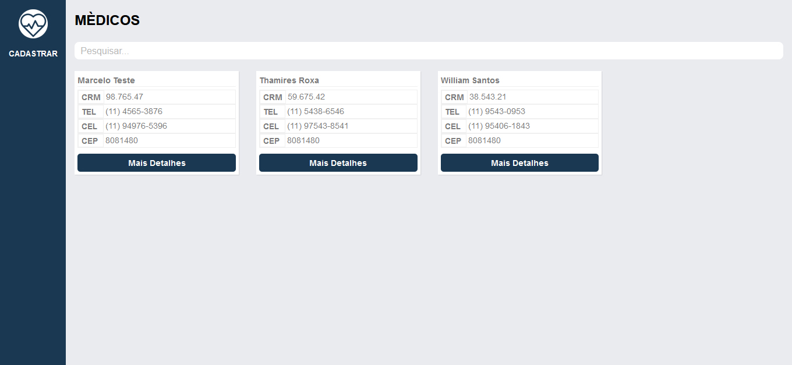
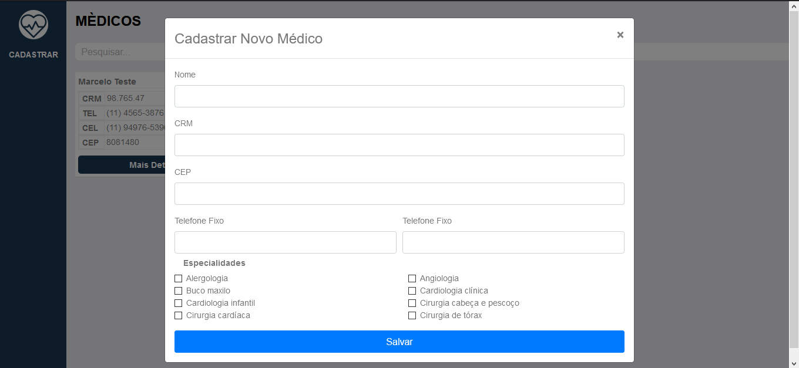
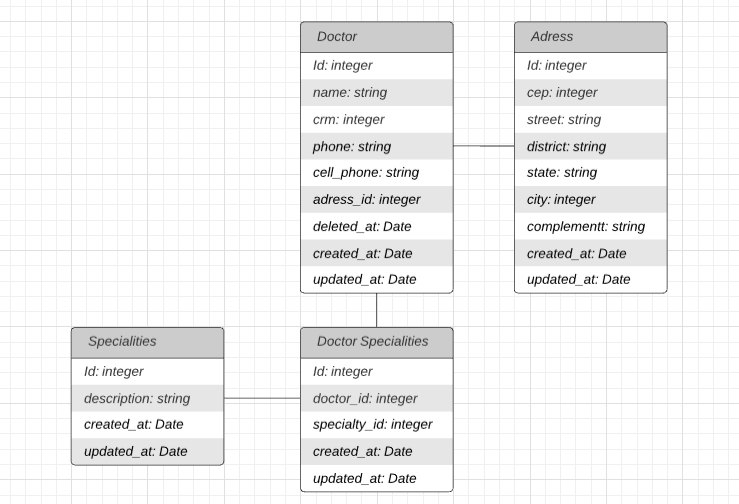

<p align="center">
  
</p>
<p align="center">
  App de cadastro de médicos com integração com a api dos correrios
  <strong>Front-end não foi 100% implementado</strong>
</p>
<p align="center">
  
</p>

## Tecnologias
```
- [x] NodeJS
- [x] Express
- [x] Postgresql
- [x] Sequelize
- [x] Typescript
- [x] Soap
```
```
- [x] ReactJS
- [x] Bootstrap
- [x] Axios
- [x] Styled Components
```

## Imagem
<p align="center">
  
</p>
<p align="center">
  
</p>

## Schema Banco de Dados

<p align="center">
  
</p>

## Instalação
### Back-end 
```
Criar Tabela faceuser no banco de dados

Configurar os campos (username, password, host) do arquivo backend-faceuser/src/configs/databaseConf.js conforme os dados do seu banco
    username: (o seu usuário do banco de dados),
    password: (a senha do seu usuário no banco de dados),
    host: (host do seu banco de dados),
    
    Exemplo:
    username: 'postgres',
    password: '12345',
    host: 'localhost',
    
cd backend-faceuser
npx sequelize-cli db:migrate (Carregar schema das tabelas)
npm run dev
```

### Front-end (Web)
```
cd web-medicuser
npm install
npm start
```
